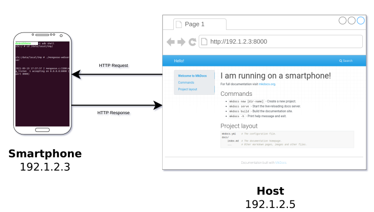

# Smartphone as a Webserver

**Smartphone as a webserver: a case study on the X3C**

A **project template** for cross compiling a *mongoose*-based *webserver* (HTTP server) for *Arm processors* to serve static web content natively.

*Perfectly suited for flat-file content management systems.*



#### Motivation

On average, each of us probably owns more than two mobile devices (or even more), many of them without any real purpose. Especially, when the touchscreen is broken and the device cannot be used in the conventional way. Doomed to spend the rest of their existence in a dark corner. 

The computing power of these mini-computers is far too good to be left useless because of the resources that were put into these devices.
The question is: How can one breathe new life into these devices?

#### Goal
The aim of this project is to turn your smartphone into a fully-fledged webserver, that can be reached from everywhere.

In particular, this project shows how to serve static html files from your [Sony Xperia Z3 Compact](#Sony-Xperia-Z3-Compact:-System-infos) - a powerful mini computer.
(However, it should worḱ on most any other Android phone.)

The webserver is implemented using [Mongoose](https://github.com/cesanta/mongoose) - a networking framework for C/C++ for event-driven web technologies.
The project template is grounded heavily on the examples provided at [GitHub](https://github.com/cesanta/mongoose/tree/master/examples).

#### Prerequisites
- Activate USB debugging on your smartphone
- CMake 3.10.2
- Android SDK ADB, check `adb --version`, otherwise install ADB on your development environment
- Ubuntu 18.04
  - This guide is written primarily for Linux but shall work also under Windows. Users of Windows should follow this guide first:
    https://www.jetbrains.com/help/clion/quick-tutorial-on-configuring-clion-on-windows.html
- (Optional) CLion 2021.2.2
- (Optional) Install LineageOS on your device
- (Optional) [mkdocs](https://www.mkdocs.org/) as static site generator


----


Compiled under Ubuntu 18.04 (x86_64), using `arm-linux-gnueabi-gcc (Ubuntu/Linaro 7.5.0-3ubuntu1~18.04) 7.5.0` and `arm-linux-gnueabi-g++ (Ubuntu/Linaro 7.5.0-3ubuntu1~18.04) 7.5.0`.

Tested on Sony Xperia Z3 Compact.

## Getting Started

### Installing the Toolchain

We use the *GNU C/C++ compiler for the armel architecture* which supports many 32-bit Arm processors including the [Cortex-A17](https://en.wikipedia.org/wiki/ARM_Cortex-A17).
Use the following commands to install the cross compiler toolchain:

```bash
$ sudo apt-get install gcc-arm-linux-gnueabi g++-arm-linux-gnueabi

# Test the installation
$ arm-linux-gnueabi-gcc --version
$ arm-linux-gnueabi-g++ --version
```


### Compiling the Sources

Now that the toolchain is installed, the sources must be built. However, if you do not want to follow this process, an already pre-compiled binary can be found in `./bin/` of this project. You can just go to [Deployment](#Deployment) then.

Run the following commands from the root folder of this project:

```bash
mkdir -p src/build && cd ./src/build
cmake -DCMAKE_BUILD_TYPE=Release -DCMAKE_TOOLCHAIN_FILE:PATH="./toolchain.cmake" ..
cmake --build . --config Release
cd ../../
```

Inspect binary attributes
```bash
arm-linux-gnueabi-readelf -Ah ./src/build/mongoose-webserver
```

- After toolchain is configured, you can run `rm -rf ./src/build/CMakeCache.txt ./src/build/CMakeFiles/` to re-generate toolchain again if you intent to modify the `toolchain.cmake` file.

### Deployment

After the sources have been successfully build, we have to transfer the binary and website content to the X3C.

This process is performed via ADB.

<!--
//TODO
A script called `deploy.sh` automates the whole process described in the following.
It accepts two argument indicating the binary (filename) in question and the root directory of the static site content (path).
Example:

```bash
$ ./deploy.sh ./src/build/mongoose-webserver ./resource/web_root
```
-->


#### Install the Webserver on the Smartphone

**1-)** Run the following ADB push command to transfer the binary to the device. It must be connected via USB to the host. From the root directory of this project run:

```bash
$ adb root
restarting adbd as root
$ adb push ./src/build/mongoose-webserver /data/local/tmp/mongoose-webserver && adb shell "chmod +x /data/local/tmp/mongoose-webserver"
```
Using ADB, the basic command for file transfer is as follows: `adb push SOURCE TARGET`. With `adb shell`we can submit a command to the device for execution.

#### Deploy/Update the Static Web Content

**1-)** Update the web contents in `./resources/web_root/`

**2-)** Execute the following commands from the root folder in the terminal. The device must be connected via USB to the host:

```bash
$ cd resources && zip -r webroot.zip ./web_root && adb push webroot.zip /data/local/tmp && adb shell "cd /data/local/tmp/ && unzip -o /data/local/tmp/webroot.zip && rm -rf webroot.zip" && rm -f webroot.zip && cd ..
```

This copies every file and directory within the `./resources/web_root` of the project to the location `/data/local/tmp/web_root/` on your device.


### Execution

Execute the following commands. A connection to the device is established first via ADB:

```bash
# if not alreay executed, do
$ adb root 
restarting adbd as root
# Enter the shell of the device
$ adb shell
z3c:/ > cd /data/local/tmp # change directory
z3c:/data/local/tmp > ./mongoose-webserver # start the webserver
2048-09-13 13:09:00 2 mongoose.c:3300:mg_listen  1 accepting on http://192.1.2.3:8000 (port 8000)
^C
130|z3c:/data/local/tmp >
```

From the host system, open the browser and navigate to the phone's IP address, in this case it is `http://192.1.2.3:8000`.

You should see a website served directly from the smartphone.

## What else?

### Constraints

- The software cannot be executed from the SD-card because of "noexec"
    https://android.stackexchange.com/questions/45554/running-own-executable-on-android-shell/45564
    -> must be placed in internal storage with write access, e.g., /data/ 

### Common Issues

ADB Permission Issue
- apply proper permissions in the udev rules: https://askubuntu.com/questions/908306/adb-no-permissions-on-ubuntu-17-04/954053#954053

### SSH

Instead of using ADB, it should theoretically work also with SSH. Here are some links to get you started:

- [SSHD on LineageOS 14.1](https://lisas.de/~alex/?p=237)

- [Native SSH server on LinageOS](https://binfalse.de/2018/09/06/native-ssh-server-on-linageos/)
  
- Automatic Startup of scripts: [here](https://h4des.org/blog/index.php?/archives/359-Android-LineageOS-16-Execute-Script-on-Start-Up.html) and [here](https://forum.xda-developers.com/lineage/general/how-to-enable-init-d-to-function-t3810355)

### Sony Xperia Z3 Compact: System infos

The "ARMv7 Processor rev 1 (v7l)" is a [**ARM Cortex-A17**](https://en.wikipedia.org/wiki/ARM_Cortex-A17)

(Cmake flag) ARM Architecture Name is ["ARMv7-A" (cortex-a series)](https://en.wikipedia.org/wiki/List_of_ARM_microarchitectures)

```
z3c / # cat /proc/cpuinfo
Processor       : ARMv7 Processor rev 1 (v7l)
processor       : 0
BogoMIPS        : 38.00

processor       : 1
BogoMIPS        : 38.00

processor       : 2
BogoMIPS        : 38.00

processor       : 3
BogoMIPS        : 38.00

Features        : swp half thumb fastmult vfp edsp neon vfpv3 tls vfpv4 idiva idivt vfpd32
CPU implementer : 0x51
CPU architecture: 7
CPU variant     : 0x2
CPU part        : 0x06f
CPU revision    : 1

Hardware        : Qualcomm MSM8974PRO-AC
Revision        : 0000
Serial          : 0000000000000000
```

```
z3c: # uname -a
Linux localhost 3.4.113-g3f88c20 #1 SMP PREEMPT Tue Oct 20 05:02:18 UTC 2020 armv7l
```


- [CPU implementer 0x51 indicates: Qualcomm Inc.](https://developer.arm.com/documentation/ddi0595/2021-06/External-Registers/MIDR-EL1--Main-ID-Register)
- [Difference between revision and variant](https://stackoverflow.com/questions/43118111/what-is-the-difference-between-cpu-revision-and-revision-fields-for-arm-processo)

- armv7l is a 32 bit processor

